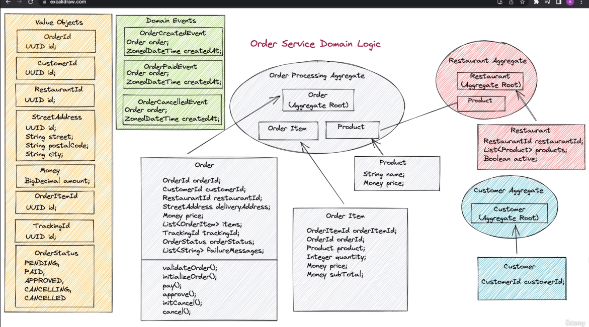

Visão Inicial do projeto

Os Microserviços foram baseados em uma arquitetura hexagonal e conceitos de arquitetura Limpa.

A interface de camadas de dados (Data Layer Interface) é a definição de porta de saida que vai precisar ser implementada por um adaptador.(Data Layer Adapter)
Esta interface incluirá todos os métodos relacionados à fonte de dados que a camada de domínio requer para completar o logíca de negócios.
Verificando a imagem a camada de dados depende da camada de negócios.

Vantagens:
- A camada de negócios pode ser desenvolvida e testada sem exigir uma implementação real da camada de dados. (Develop and Test Independently "Desenvolva e teste independentemente")
- quando implementamos a camada de dados, podemos alterar essa implementação sem afetar a
  camada de negócios, desde que obedeçamos aos contratos na interface da camada de dados, que está na camada de negócios. (Easily replacable "facil substituir")

Para usar a interface durante a codificação na camada de coominio é preciso usar <b>injeção de dependencia (DI)</b>

Outra questão é para usarmos a camada de negócio e a camada de dados juntas é preciso usar um outro componente.
Exemplo na imagem "CONTAINER" ele vai possuir a classe principal do Spring boot. Nesse componente vai ter uma dependencia de negocio, camada de dados e também API.
Os registros do Bean serão no modulo container
As portas de saída e o implementador dessas portas como adaptadores secundários.
Em uma arquitetura limpa

----
**API - Injeta a interface do dominio** 
A porta de entrada pode ser chamada como porta da camada de domínio.(Verde-domain "Domain Layer Interface")
Esta porta também é uma interface, quando pensamos em Java, e exigirá um implementador, e
ser implementado na própria camada de domínio. ("Domain Layer Adapter")
A camada da API injetará e usará a porta de entrada usando injeção de dependência.</b>Interface do domain da porta de entrada</b>
As chamadas de método serão delegadas à implementação, que também vão está na camada de domínio. Em termos de arquitetura hexagonal, a camada de API que usa a porta de entrada é um adaptador primário.
É um adaptador porque pode ser facilmente alterado sem tocar na camada de domínio. Graças ao uso da porta de entrada.
O adaptador da camada de dados na camada de dados era um adaptador secundário na arquitetura limpa

**Serviço Externo**</b>
Digamos que você precise ter uma chamada de serviço externa na camada de negócios.
Então eu tenho um serviço externo aqui. De acordo com o princípio de arquitetura limpa que acabei de aplicar
Como podemos integrar esse serviço externo no aplicativo?
Novamente.
Vou adicionar uma porta na camada de negócios.
Desta vez vou chamá-lo como porta de serviço externa.(External Service Port)
E então implemente no serviço externo com um adaptador, que é um adaptador secundário em hexagonal
termos de arquitetura. (External Service Adapter " Secondary")

**Broker Messagens** 
Em seguida, podemos adicionar um componente de mensagens.
Novamente aplicando o princípio de inversão de dependência Vou adicionar uma interface de porta de mensagens na camada de negócios. (Messaging Port)
E implemente-o com um adaptador de mensagens no componente de mensagens. (Messaging Adapter)
Digamos que este adaptador usará Kafka.
No entanto, como mencionado, quando você deseja alterar o adaptador com qualquer outra tecnologia de mensagens
Será uma operação indolor graças à arquitetura limpa que você usa.
Assim, no futuro, você pode facilmente alterar o barramento de mensagens do Kafka para qualquer outra solução.

------
No final, a lógica central será o componente mais independente e estável desta aplicação.
E permitirá desenvolver e testar a lógica de negócios de forma independente.
Domain - (Independent & Stable)

------

**DDD - Conceitos**

**Entidades - (Entities)** - são os objetos de domínio principais. Eles têm a lógica crítica de negócios. Uma entidade deve ter um único identificador que é atribuído a uma entidade quando é criado e permanece inalterado ao longo da vida da entidade.**Objeto de domínio com uma identidade única. Incorpora um conjunto de regras críticas de negócios.**

**Agregado - (Aggregates)**, que é um grupo de objetos de entidade que são logicamente relacionados.Por exemplo, você pode ter um agregado de processo de pedido que inclui pedido, peça e produto do pedido entidades. O importante com um agregado é que ele deve ser recuperado e armazenado como um todo de forma consistente. Estado.
Esses requisitos nos levam ao próximo conceito.

**Raiz agregada - (Aggregate Root (AR))** Uma raiz agregada é responsável por manter os agregados em um estado consistente Tempo.

**Objetos de valor - (Value Objects)** são usados para trazer contexto ao valor. Uma característica importante do objeto de valor é que ele é imutável.
Isso significa que, quando você criou uma vez, não pode alterar seu valor.Se você deseja alterar o valor, basta criar um novo objeto de valor com o valor atualizado. Graças a esse valor de imutabilidade, os objetos são intercambiáveis. Isso significa que você pode usar dois objetos de valor diferentes com o mesmo valor para a mesma finalidade.

**Eventos de domínio - (Domain Events)** são excelentes ferramentas para desacoplar os domínios que estão em diferentes contextos limitados.
Se você deseja executar uma lógica de negócios com base em um evento em outro domínio, você pode criar um evento de domínio
ouvintes e se inscrever nos eventos desse domínio. O importante ao distribuir e consumir eventos, é ter um sistema com uma operação de repetição.

**Um serviço de domínio - (Domain Services)** coordena a lógica de negócios que abrange vários agregados.Além disso, podemos colocar métodos de lógica de negócios no serviço de domínio se o método não se encaixar logicamente em uma entidade. Observe que o serviço de domínio ainda está no núcleo da lógica de domínio, portanto, não pode ser acessado de fora. É da responsabilidade do serviço de domínio e entidades as logicas de negocios.

**serviços de aplicativo - (Application Service)** E para se comunicar com a lógica externa do domínio, estamos chegando aos serviços de aplicativo.Esses são os serviços que expõem os métodos de domínio necessários para o exterior. o serviço de aplicativo não deve ter nenhuma lógica de negócios.

Portanto, você deve ter uma interface com os métodos que os objetos externos exigem e expor essa interface.

Visualize dependencies:
https://github.com/ferstl/depgraph-maven-plugin
mvn com.github.ferstl:depgraph-maven-plugin:aggregate -DcreateImage=true -DreduceEdges=false -Dscope=compile "-Dincludes=com.food.ordering.system*:*"
